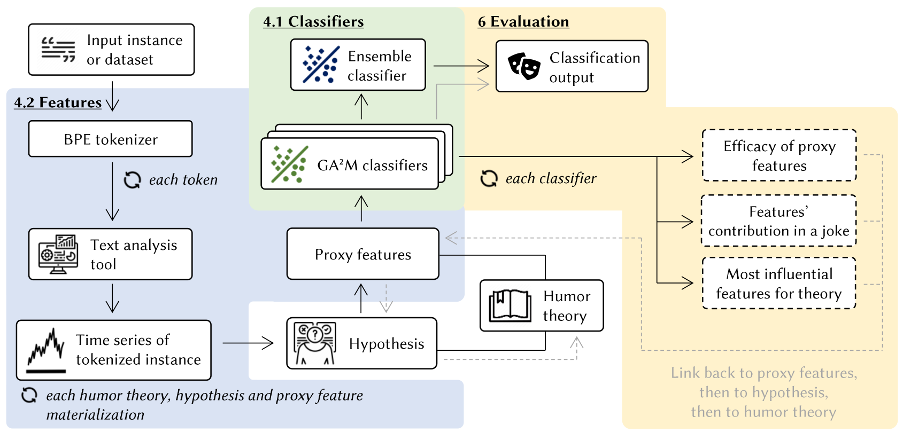

    

  <strong>A theory-driven framework for computational humor detection</strong>

Logo automatically generated by ChatGPT on 02/23/2024.
#

**THInC** is a framework for computational humor detection that is driven by humor theories. This Github repository is an implementation of the THInC framework by the authors. The language of this code is **Python** using a **Python Notebook**. The calculation of the proxy features in our implementation is pre-saved, as is the benchmark RoBERTa model. For results, we would like to refer to our paper, for which a reference can be found below.

## File structure
- `README.md`: this file
- `THInC framework.ipynb`: the Python notebook containing all the source code needed to train and test all models, and to do the interpretability evaluations
- `requirements.txt`: the Python requirements for running the source code notebook
- `images/`: the images for this README file
- `datasets/`: datasets that are used in this implementation
- `saves/`: pre-calculated proxy features and time series
  - `saves/models/`: saved finetuned benchmark model

## Prerequisites and usage
All requirements for the Python environment can be found in `requirements.txt`. Notice that a custom installation of the transformers or Pytorch packages might be needed, depending on the architecture this code is run on. You need to be able to run Python notebooks to run this repository.

The most architecture-intensive parts of the source code are 3.1.a (requiring to load Llama-2-13b in half precision), 3.1.g (requiring around 10 GB of RAM), and 4.1 (requiring to load a large RoBERTa model).

To run this source code, simply run all cells of the Notebook `THInC framework.ipynb`. More information about which part concerns which calculation can be found inside the notebook.

The quickest run of our implementation can be achieved by running Sections 1, 2 and 4.2 in the notebook, providing all results and interpretability possibilities, without the benchmark model. This quick run is possible on most modern architectures without using too much resources.

## Reference
TBA
